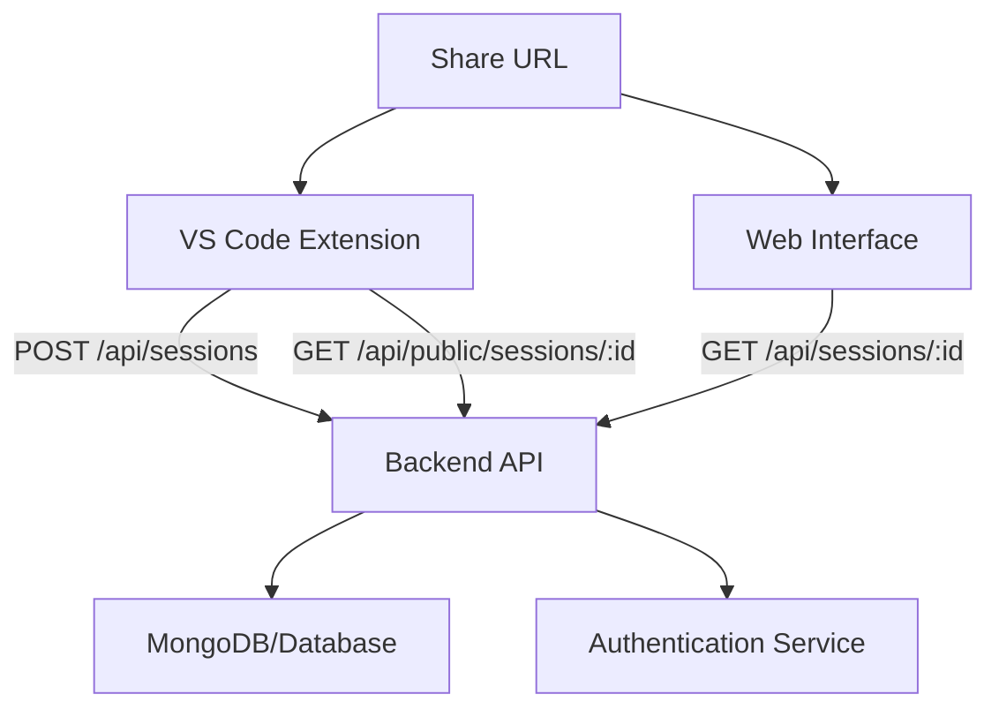

# Session Sharing Backend API Documentation

This document provides a comprehensive specification for the backend API that supports session sharing between the SyntX VS Code extension and web interface.

## Table of Contents

1. [Overview](#overview)
2. [Architecture](#architecture)
3. [Data Schema](#data-schema)
4. [API Endpoints](#api-endpoints)
5. [Authentication](#authentication)
6. [Database Schema](#database-schema)
7. [Implementation Examples](#implementation-examples)
8. [Testing](#testing)
9. [Security Considerations](#security-considerations)
10. [Error Handling](#error-handling)

## Overview

The session sharing system enables users to export their VS Code extension conversations and share them via URLs. Other users can then import these sessions into their VS Code extension using the shared URL.

### Key Features

- **Export Sessions**: VS Code extension uploads session data to get a shareable URL
- **Import Sessions**: VS Code extension downloads session data from a shared URL
- **Web Interface**: Users can view shared sessions in a web browser
- **Flexible URL Format**: Support for share URLs, API URLs, and direct session IDs
- **Authentication**: API key-based authentication compatible with existing Lagrange UserDB

### User Flow

1. **Export**: User clicks "Share" in VS Code → Session uploaded to API → Share URL returned
2. **Share**: User copies share URL and sends to others
3. **Import**: Recipient pastes URL into VS Code → Session downloaded and imported
4. **View**: Anyone can view session in web browser via share URL

## Architecture



### Components

1. **VS Code Extension**: Client that exports/imports sessions
2. **Backend API**: REST API for session CRUD operations
3. **Web Interface**: Browser-based session viewer
4. **Database**: Session storage (MongoDB/PostgreSQL)
5. **Authentication**: API key validation service

## Data Schema

### Core Types

#### SerializedSession

The main data structure for session sharing:

```typescript
interface SerializedSession {
	version: string // Schema version (e.g., "1.0.0")
	task: HistoryItem // Task metadata
	messages: ClineMessage[] // Chat conversation history

	// Additional metadata (stored in database)
	id: string // Unique session identifier
	title?: string // Optional session title
	description?: string // Optional description
	createdAt: string // ISO 8601 timestamp
	updatedAt: string // ISO 8601 timestamp
	userId?: string // Creator's user ID (if authenticated)
	isPublic: boolean // Whether session is publicly accessible
	expiresAt?: string // Optional expiration date
	tags?: string[] // Optional tags for categorization
	viewCount: number // Number of times viewed
}
```

#### HistoryItem

Task metadata structure:

```typescript
interface HistoryItem {
	id: string // Task ID
	number: number // Task number in sequence
	ts: number // Unix timestamp
	task: string // Task description/title
	tokensIn: number // Input tokens used
	tokensOut: number // Output tokens used
	cacheWrites?: number // Cache write operations
	cacheReads?: number // Cache read operations
	totalCost: number // API cost in USD
	size?: number // Session size in bytes
	workspace?: string // Workspace path
}
```

#### ClineMessage

Individual chat message structure:

```typescript
interface ClineMessage {
	ts: number // Message timestamp
	type: "ask" | "say" // Message type
	ask?: ClineAsk // Ask type (if type === "ask")
	say?: ClineSay // Say type (if type === "say")
	text?: string // Message text content
	images?: string[] // Base64 encoded images
	partial?: boolean // Whether message is partial
	reasoning?: string // AI reasoning (if available)
	conversationHistoryIndex?: number // Index in conversation
	checkpoint?: Record<string, unknown> // Checkpoint data
	progressStatus?: ToolProgressStatus // Tool progress
	contextCondense?: ContextCondense // Context condensation info
	isProtected?: boolean // Whether message is protected
	apiProtocol?: "openai" | "anthropic" // API protocol used
}
```

#### ClineAsk Types

```typescript
type ClineAsk =
	| "followup" // Clarifying question
	| "command" // Permission to run command
	| "command_output" // Permission to read command output
	| "completion_result" // Task completed, awaiting feedback
	| "tool" // Permission to use tool
	| "api_req_failed" // API request failed, retry?
	| "resume_task" // Confirm task resumption
	| "resume_completed_task" // Resume completed task
	| "mistake_limit_reached" // Too many errors
	| "browser_action_launch" // Permission for browser action
	| "use_mcp_server" // Permission for MCP server
	| "auto_approval_max_req_reached" // Auto-approval limit reached
```

#### ClineSay Types

```typescript
type ClineSay =
	| "error" // Error message
	| "api_req_started" // API request started
	| "api_req_finished" // API request finished
	| "api_req_retried" // API request retried
	| "api_req_retry_delayed" // Retry delayed
	| "api_req_deleted" // Request deleted
	| "text" // Regular text message
	| "reasoning" // AI reasoning
	| "completion_result" // Task completion result
	| "user_feedback" // User feedback
	| "user_feedback_diff" // User feedback with diff
	| "command_output" // Command output
	| "shell_integration_warning" // Shell integration warning
	| "browser_action" // Browser action
	| "browser_action_result" // Browser action result
	| "mcp_server_request_started" // MCP request started
	| "mcp_server_response" // MCP response
	| "subtask_result" // Subtask result
	| "checkpoint_saved" // Checkpoint saved
	| "rooignore_error" // .syntxignore error
	| "diff_error" // Diff application error
	| "condense_context" // Context condensation
	| "condense_context_error" // Context condensation error
	| "codebase_search_result" // Codebase search result
	| "user_edit_todos" // User edited todos
```

## API Endpoints

### 1. Create Session (Export)

Creates a new shareable session.

**Endpoint:** `POST /api/sessions`

**Authentication:** Required (API Key)

**Headers:**

```http
Content-Type: application/json
Syntx-Api-Key: {user_api_key}
```

**Request Body:**

```typescript
{
  version: string;           // Schema version
  task: HistoryItem;        // Task metadata
  messages: ClineMessage[]; // Chat messages
  title?: string;           // Optional title
  description?: string;     // Optional description
  tags?: string[];          // Optional tags
  isPublic?: boolean;       // Public accessibility (default: true)
  expiresAt?: string;       // Optional expiration (ISO 8601)
}
```

**Response (201 Created):**

```typescript
{
  id: string;               // Session ID
  url: string;              // Share URL
  createdAt: string;        // Creation timestamp
  expiresAt?: string;       // Expiration if set
}
```

**Example:**

```bash
curl -X POST "https://api.syntx.dev/api/sessions" \
  -H "Content-Type: application/json" \
  -H "Syntx-Api-Key: lagrange_key_abc123" \
  -d '{
    "version": "1.0.0",
    "task": {
      "id": "task_001",
      "number": 1,
      "ts": 1703097600,
      "task": "Build a React component",
      "tokensIn": 1500,
      "tokensOut": 800,
      "totalCost": 0.05,
      "workspace": "/home/user/project"
    },
    "messages": [
      {
        "ts": 1703097600,
        "type": "say",
        "say": "text",
        "text": "I'll help you build a React component."
      }
    ],
    "title": "React Component Tutorial",
    "isPublic": true
  }'
```

### 2. Get Session - Public Access (Import)

Retrieves session data for import by VS Code extension.

**Endpoint:** `GET /api/public/sessions/{session_id}`

**Authentication:** Optional (API Key recommended for rate limiting)

**Headers:**

```http
Accept: application/json
Syntx-Api-Key: {user_api_key}  # Optional but recommended
```

**Path Parameters:**

- `session_id` (string): The session identifier

**Response (200 OK):**

```typescript
{
  version: string;
  task: HistoryItem;
  messages: ClineMessage[];
  id: string;
  title?: string;
  description?: string;
  createdAt: string;
  tags?: string[];
  viewCount: number;
}
```

**Example:**

```bash
curl -X GET "https://api.syntx.dev/api/public/sessions/abc123xyz" \
  -H "Accept: application/json" \
  -H "Syntx-Api-Key: lagrange_key_abc123"
```

### 3. Get Session - Authenticated Access

Retrieves session data for authenticated users (web interface).

**Endpoint:** `GET /api/sessions/{session_id}`

**Authentication:** Required (API Key)

**Headers:**

```http
Accept: application/json
Syntx-Api-Key: {user_api_key}
```

**Path Parameters:**

- `session_id` (string): The session identifier

**Response (200 OK):**
Same as public access, but may include additional metadata for authenticated users.

### 4. List Sessions (Optional)

Lists sessions for authenticated users.

**Endpoint:** `GET /api/sessions`

**Authentication:** Required (API Key)

**Headers:**

```http
Accept: application/json
Syntx-Api-Key: {user_api_key}
```

**Query Parameters:**

- `limit` (number, default: 20): Number of sessions to return
- `offset` (number, default: 0): Pagination offset
- `tag` (string, optional): Filter by tag
- `search` (string, optional): Search in title/description

**Response (200 OK):**

```typescript
{
  sessions: SerializedSession[];
  total: number;
  limit: number;
  offset: number;
}
```

### 5. Update Session (Optional)

Updates session metadata.

**Endpoint:** `PATCH /api/sessions/{session_id}`

**Authentication:** Required (API Key, owner only)

**Request Body:**

```typescript
{
  title?: string;
  description?: string;
  tags?: string[];
  isPublic?: boolean;
  expiresAt?: string;
}
```

### 6. Delete Session (Optional)

Deletes a session.

**Endpoint:** `DELETE /api/sessions/{session_id}`

**Authentication:** Required (API Key, owner only)

**Response (204 No Content)**

### 7. Health Check

Health status endpoint.

**Endpoint:** `GET /api/health`

**Authentication:** None

**Response (200 OK):**

```typescript
{
	status: "ok"
	timestamp: string
	version: string
}
```

## Authentication

### API Key Authentication

The system uses API key authentication compatible with the existing Lagrange UserDB system.

**Header Format:**

```http
Syntx-Api-Key: lagrange_key_abc123def456
```

### Authentication Flow

1. **User Registration**: Users register and receive an API key from Lagrange UserDB
2. **API Key Validation**: Backend validates API key with Lagrange UserDB service
3. **User Identification**: API key is used to identify the user for ownership/permissions
4. **Rate Limiting**: API keys can be used for rate limiting and analytics

### Public vs Authenticated Access

- **Public Endpoints**: `/api/public/sessions/{id}` - No authentication required
- **Authenticated Endpoints**: `/api/sessions/*` - API key required
- **Owner Actions**: Create, update, delete - Requires ownership validation

## Database Schema

### MongoDB Schema

```javascript
// Sessions Collection
{
  _id: "session_abc123xyz",           // Session ID (primary key)
  version: "1.0.0",                   // Schema version

  // Core session data
  task: {
    id: "task_001",
    number: 1,
    ts: 1703097600,
    task: "Build a React component",
    tokensIn: 1500,
    tokensOut: 800,
    totalCost: 0.05,
    workspace: "/home/user/project"
  },
  messages: [
    {
      ts: 1703097600,
      type: "say",
      say: "text",
      text: "I'll help you build a React component."
    }
    // ... more messages
  ],

  // Metadata
  title: "React Component Tutorial",
  description: "A step-by-step guide to building React components",
  tags: ["react", "tutorial", "components"],

  // Access control
  userId: "user_123",                 // Creator's user ID
  isPublic: true,                     // Public accessibility

  // Timestamps
  createdAt: ISODate("2023-12-20T12:00:00Z"),
  updatedAt: ISODate("2023-12-20T12:00:00Z"),
  expiresAt: ISODate("2024-12-20T12:00:00Z"), // Optional

  // Analytics
  viewCount: 42,
  lastViewedAt: ISODate("2023-12-21T10:30:00Z")
}
```

### PostgreSQL Schema (Alternative)

```sql
-- Sessions table
CREATE TABLE sessions (
    id VARCHAR(255) PRIMARY KEY,
    version VARCHAR(50) NOT NULL,

    -- JSON columns for complex data
    task_data JSONB NOT NULL,
    messages_data JSONB NOT NULL,

    -- Metadata
    title VARCHAR(500),
    description TEXT,
    tags TEXT[],

    -- Access control
    user_id VARCHAR(255),
    is_public BOOLEAN DEFAULT true,

    -- Timestamps
    created_at TIMESTAMP WITH TIME ZONE DEFAULT NOW(),
    updated_at TIMESTAMP WITH TIME ZONE DEFAULT NOW(),
    expires_at TIMESTAMP WITH TIME ZONE,

    -- Analytics
    view_count INTEGER DEFAULT 0,
    last_viewed_at TIMESTAMP WITH TIME ZONE
);

-- Indexes
CREATE INDEX idx_sessions_user_id ON sessions(user_id);
CREATE INDEX idx_sessions_created_at ON sessions(created_at DESC);
CREATE INDEX idx_sessions_is_public ON sessions(is_public) WHERE is_public = true;
CREATE INDEX idx_sessions_tags ON sessions USING GIN(tags);
CREATE INDEX idx_sessions_expires_at ON sessions(expires_at) WHERE expires_at IS NOT NULL;

-- Full text search (optional)
CREATE INDEX idx_sessions_search ON sessions USING GIN(
    to_tsvector('english', COALESCE(title, '') || ' ' || COALESCE(description, ''))
);
```

## Implementation Examples

### FastAPI (Python) Implementation

```python
from fastapi import FastAPI, HTTPException, Header, Depends
from pydantic import BaseModel
from typing import Optional, List
import pymongo
from datetime import datetime, timedelta
import uuid

app = FastAPI()

# Database connection
client = pymongo.MongoClient("mongodb://localhost:27017/")
db = client.syntx_sessions
sessions_collection = db.sessions

# Pydantic models
class TaskData(BaseModel):
    id: str
    number: int
    ts: int
    task: str
    tokensIn: int
    tokensOut: int
    totalCost: float
    workspace: Optional[str] = None

class MessageData(BaseModel):
    ts: int
    type: str
    ask: Optional[str] = None
    say: Optional[str] = None
    text: Optional[str] = None
    # ... other message fields

class CreateSessionRequest(BaseModel):
    version: str
    task: TaskData
    messages: List[MessageData]
    title: Optional[str] = None
    description: Optional[str] = None
    tags: Optional[List[str]] = None
    isPublic: Optional[bool] = True
    expiresAt: Optional[str] = None

class SessionResponse(BaseModel):
    id: str
    url: str
    createdAt: str
    expiresAt: Optional[str] = None

# Authentication dependency
async def verify_api_key(syntx_api_key: Optional[str] = Header(None, alias="Syntx-Api-Key")):
    if not syntx_api_key:
        return None

    # Validate with Lagrange UserDB
    user_id = await validate_lagrange_api_key(syntx_api_key)
    return user_id

async def require_api_key(user_id: Optional[str] = Depends(verify_api_key)):
    if not user_id:
        raise HTTPException(status_code=401, detail="Valid API key required")
    return user_id

# Routes
@app.post("/api/sessions", response_model=SessionResponse)
async def create_session(
    request: CreateSessionRequest,
    user_id: str = Depends(require_api_key)
):
    session_id = str(uuid.uuid4())[:12]
    now = datetime.utcnow()

    session_doc = {
        "_id": session_id,
        "version": request.version,
        "task": request.task.dict(),
        "messages": [msg.dict() for msg in request.messages],
        "title": request.title,
        "description": request.description,
        "tags": request.tags or [],
        "userId": user_id,
        "isPublic": request.isPublic,
        "createdAt": now,
        "updatedAt": now,
        "expiresAt": datetime.fromisoformat(request.expiresAt) if request.expiresAt else None,
        "viewCount": 0
    }

    sessions_collection.insert_one(session_doc)

    share_url = f"https://syntx.dev/session/{session_id}"

    return SessionResponse(
        id=session_id,
        url=share_url,
        createdAt=now.isoformat(),
        expiresAt=request.expiresAt
    )

@app.get("/api/public/sessions/{session_id}")
async def get_public_session(
    session_id: str,
    user_id: Optional[str] = Depends(verify_api_key)
):
    session = sessions_collection.find_one({"_id": session_id})

    if not session:
        raise HTTPException(status_code=404, detail="Session not found")

    # Check if session has expired
    if session.get("expiresAt") and session["expiresAt"] < datetime.utcnow():
        raise HTTPException(status_code=410, detail="Session has expired")

    # Check if session is public (unless user is owner)
    if not session.get("isPublic", True) and session.get("userId") != user_id:
        raise HTTPException(status_code=403, detail="Session is private")

    # Increment view count
    sessions_collection.update_one(
        {"_id": session_id},
        {
            "$inc": {"viewCount": 1},
            "$set": {"lastViewedAt": datetime.utcnow()}
        }
    )

    # Return session data (remove internal fields)
    response_data = {
        "id": session["_id"],
        "version": session["version"],
        "task": session["task"],
        "messages": session["messages"],
        "title": session.get("title"),
        "description": session.get("description"),
        "tags": session.get("tags", []),
        "createdAt": session["createdAt"].isoformat(),
        "viewCount": session.get("viewCount", 0) + 1
    }

    return response_data

@app.get("/api/sessions/{session_id}")
async def get_session(
    session_id: str,
    user_id: str = Depends(require_api_key)
):
    session = sessions_collection.find_one({"_id": session_id})

    if not session:
        raise HTTPException(status_code=404, detail="Session not found")

    # Check ownership or public access
    if session.get("userId") != user_id and not session.get("isPublic", True):
        raise HTTPException(status_code=403, detail="Access denied")

    # Return full session data for authenticated users
    return session

async def validate_lagrange_api_key(api_key: str) -> Optional[str]:
    """Validate API key with Lagrange UserDB service"""
    # Implementation depends on your Lagrange UserDB integration
    # This should make an HTTP request to validate the key
    # and return the user ID if valid
    pass

if __name__ == "__main__":
    import uvicorn
    uvicorn.run(app, host="0.0.0.0", port=8000)
```

### Express.js (Node.js) Implementation

```javascript
const express = require("express")
const { MongoClient } = require("mongodb")
const { v4: uuidv4 } = require("uuid")
const app = express()

app.use(express.json())

// Database connection
let db
MongoClient.connect("mongodb://localhost:27017/syntx_sessions").then((client) => {
	db = client.db()
	console.log("Connected to MongoDB")
})

// Authentication middleware
const verifyApiKey = async (req, res, next) => {
	const apiKey = req.headers["syntx-api-key"]

	if (apiKey) {
		try {
			const userId = await validateLagrangeApiKey(apiKey)
			req.userId = userId
		} catch (error) {
			req.userId = null
		}
	}

	next()
}

const requireApiKey = (req, res, next) => {
	if (!req.userId) {
		return res.status(401).json({ error: "Valid API key required" })
	}
	next()
}

// Routes
app.post("/api/sessions", verifyApiKey, requireApiKey, async (req, res) => {
	try {
		const sessionId = uuidv4().substring(0, 12)
		const now = new Date()

		const sessionDoc = {
			_id: sessionId,
			version: req.body.version,
			task: req.body.task,
			messages: req.body.messages,
			title: req.body.title,
			description: req.body.description,
			tags: req.body.tags || [],
			userId: req.userId,
			isPublic: req.body.isPublic !== false,
			createdAt: now,
			updatedAt: now,
			expiresAt: req.body.expiresAt ? new Date(req.body.expiresAt) : null,
			viewCount: 0,
		}

		await db.collection("sessions").insertOne(sessionDoc)

		const shareUrl = `https://syntx.dev/session/${sessionId}`

		res.status(201).json({
			id: sessionId,
			url: shareUrl,
			createdAt: now.toISOString(),
			expiresAt: req.body.expiresAt,
		})
	} catch (error) {
		res.status(500).json({ error: "Failed to create session" })
	}
})

app.get("/api/public/sessions/:sessionId", verifyApiKey, async (req, res) => {
	try {
		const session = await db.collection("sessions").findOne({
			_id: req.params.sessionId,
		})

		if (!session) {
			return res.status(404).json({ error: "Session not found" })
		}

		// Check expiration
		if (session.expiresAt && session.expiresAt < new Date()) {
			return res.status(410).json({ error: "Session has expired" })
		}

		// Check public access
		if (!session.isPublic && session.userId !== req.userId) {
			return res.status(403).json({ error: "Session is private" })
		}

		// Increment view count
		await db.collection("sessions").updateOne(
			{ _id: req.params.sessionId },
			{
				$inc: { viewCount: 1 },
				$set: { lastViewedAt: new Date() },
			},
		)

		// Return session data
		const responseData = {
			id: session._id,
			version: session.version,
			task: session.task,
			messages: session.messages,
			title: session.title,
			description: session.description,
			tags: session.tags || [],
			createdAt: session.createdAt.toISOString(),
			viewCount: (session.viewCount || 0) + 1,
		}

		res.json(responseData)
	} catch (error) {
		res.status(500).json({ error: "Failed to retrieve session" })
	}
})

async function validateLagrangeApiKey(apiKey) {
	// Implementation for validating API key with Lagrange UserDB
	// Return user ID if valid, throw error if invalid
}

app.listen(8000, () => {
	console.log("Server running on port 8000")
})
```

## Testing

### Test Cases

#### 1. Create Session Tests

```bash
# Test successful session creation
curl -X POST "http://localhost:8000/api/sessions" \
  -H "Content-Type: application/json" \
  -H "Syntx-Api-Key: test_key_123" \
  -d @test_session.json

# Test missing API key
curl -X POST "http://localhost:8000/api/sessions" \
  -H "Content-Type: application/json" \
  -d @test_session.json

# Test invalid API key
curl -X POST "http://localhost:8000/api/sessions" \
  -H "Content-Type: application/json" \
  -H "Syntx-Api-Key: invalid_key" \
  -d @test_session.json
```

#### 2. Get Session Tests

```bash
# Test public session access
curl -X GET "http://localhost:8000/api/public/sessions/test_session_id"

# Test private session access without auth
curl -X GET "http://localhost:8000/api/public/sessions/private_session_id"

# Test expired session access
curl -X GET "http://localhost:8000/api/public/sessions/expired_session_id"

# Test non-existent session
curl -X GET "http://localhost:8000/api/public/sessions/nonexistent"
```

#### 3. Authentication Tests

```bash
# Test valid API key
curl -X GET "http://localhost:8000/api/sessions/test_session_id" \
  -H "Syntx-Api-Key: valid_key_123"

# Test invalid API key
curl -X GET "http://localhost:8000/api/sessions/test_session_id" \
  -H "Syntx-Api-Key: invalid_key"

# Test missing API key
curl -X GET "http://localhost:8000/api/sessions/test_session_id"
```

### Test Data

**test_session.json:**

```json
{
	"version": "1.0.0",
	"task": {
		"id": "test_task_001",
		"number": 1,
		"ts": 1703097600,
		"task": "Test session creation",
		"tokensIn": 100,
		"tokensOut": 50,
		"totalCost": 0.01,
		"workspace": "/test/workspace"
	},
	"messages": [
		{
			"ts": 1703097600,
			"type": "say",
			"say": "text",
			"text": "This is a test message"
		},
		{
			"ts": 1703097660,
			"type": "ask",
			"ask": "followup",
			"text": "How would you like to proceed?"
		}
	],
	"title": "Test Session",
	"description": "A test session for API validation",
	"tags": ["test", "api"],
	"isPublic": true
}
```

### Load Testing

```bash
# Use Apache Bench for basic load testing
ab -n 1000 -c 10 -H "Syntx-Api-Key: test_key_123" \
   http://localhost:8000/api/public/sessions/test_session_id

# Use Artillery for more comprehensive testing
artillery quick --count 100 --num 10 \
   http://localhost:8000/api/public/sessions/test_session_id
```

## Security Considerations

### Data Protection

1. **Input Validation**: Validate all input data against schemas
2. **SQL/NoSQL Injection**: Use parameterized queries and ODM/ORM
3. **XSS Prevention**: Sanitize text content in messages
4. **Data Size Limits**: Enforce maximum session size (e.g., 10MB)
5. **Rate Limiting**: Implement per-API-key rate limits

### Access Control

1. **API Key Validation**: Validate all API keys with Lagrange UserDB
2. **Ownership Checks**: Verify user ownership for sensitive operations
3. **Public/Private Sessions**: Respect session visibility settings
4. **Expiration Enforcement**: Check and enforce session expiration

### Privacy

1. **Data Minimization**: Only store necessary session data
2. **Anonymization**: Remove sensitive information from public sessions
3. **Audit Logging**: Log access to sessions for security monitoring
4. **Retention Policy**: Implement data retention and cleanup policies

### Infrastructure

1. **HTTPS Only**: Enforce HTTPS for all API endpoints
2. **CORS Configuration**: Configure appropriate CORS headers
3. **Database Security**: Use encrypted connections and access controls
4. **Backup Encryption**: Encrypt database backups

## Error Handling

### HTTP Status Codes

- **200 OK**: Successful GET request
- **201 Created**: Successful POST request
- **204 No Content**: Successful DELETE request
- **400 Bad Request**: Invalid request data
- **401 Unauthorized**: Missing or invalid API key
- **403 Forbidden**: Access denied (private session)
- **404 Not Found**: Session not found
- **410 Gone**: Session has
